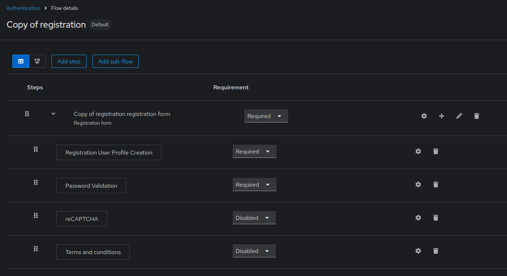
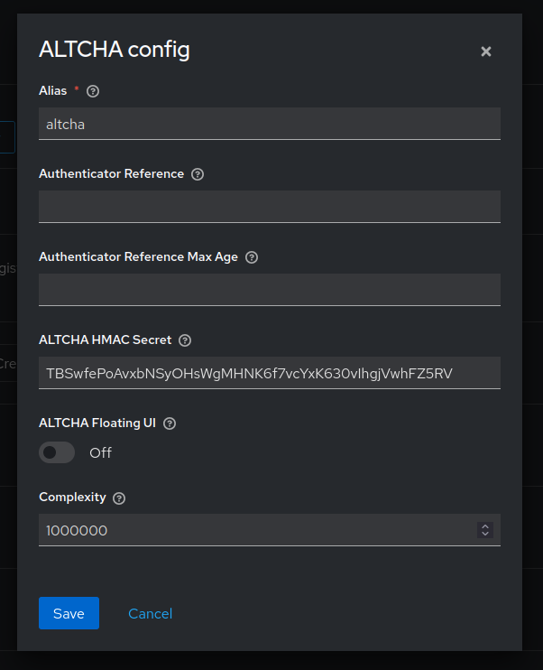

# keycloak-altcha

Fork of [keycloak-hcaptcha](https://github.com/p08dev/keycloak-hcaptcha).

To safeguard registration against bots, Keycloak has integration with Google reCAPTCHA. This extension provides similar functionality, but with a more privacy friendly provider named [ALTCHA](https://altcha.org/). The code is based [the hCaptcha extension](https://github.com/p08dev/keycloak-hcaptcha), itself based on the vanilla implementation of reCAPTCHA in Keycloak.

ALTCHA is a proof-of-work captcha generator which generates a complex math challenge taking a few seconds for a computer to solve, thus hindering exploitation of the form by spambots. The CAPTCHA doesn’t need any user interaction and is trefore accessible for disabled people.

## Installation

Download the newest release JAR (or compile it yourself - see below) and drop it into `your_keycloak_installation/providers`.

### Registration flow

There are a few steps you need to perform in the Keycloak Admin Console.

1. Click the **Authentication** left menu item and go to the **Flows** tab.
2. Search for the flow named **Registration**, click on the options dropdown at the right and click on **Duplicate**. Give it whatever name you want.
3. Click on the flow to see its steps.



4. On the parent step named `<flow name> registration form`, click the « + » icon and select **Add step**.
5. Select **ALTCHA** in the list and click **Add**.
6. Set the **ALTCHA** step requirement from Disabled to **Required**.
7. Click the gear icon at the right of the ALTCHA step, then fill the following information:
- Give it a name (`altcha` is fine)
- In the **ALTCHA HMAC Secret** field, write a random string (the longer, the better). This key will be used to sign and verify captcha challenges.
- In the **Complexity** field, use a value comprised between 100 000 and 1 500 000 rounds. Write it without spaces and ensure that the chosen integer is positive. See [ALTCHA docs](https://altcha.org/docs/complexity/) for more details.

Here’s a valid configuration example:



### Theme configuration

Now, you need to make changes on your current theme or create a new theme. Please refer to [the Keycloak documentation](https://www.keycloak.org/docs/latest/server_development/#_themes) to create or edit your own theme.

You will need to edit the [login/register.ftl](https://github.com/keycloak/keycloak/blob/main/themes/src/main/resources/theme/keycloak.v2/login/register.ftl) template file and add the following lines after the `<@registerCommons.termsAcceptance/>` if block:

```html
<#if altchaRequired??>
    <altcha-widget challengejson='${altchaPayload}' <#if altchaFloating?? && altchaFloating=="true">floating</#if> hidefooter delay="2000" auto="onload" expire="3600000" debug></altcha-widget>
</#if>
```

You can customize the widget settings following [the documentation](https://altcha.org/docs/website-integration/). Beware that you cannot edit the `expire` setting yet (see #1).

Then, drop [the minified JS file](https://eu.altcha.org/js/latest/altcha.min.js) into the `login/resources/js/` folder.

Create a new file in the `js/` folder named `altcha-import.js`, containing the following:

```js
import("./altcha.min.js")
```

In the `theme.properties` file, add `js/altcha-import.js` into the `scripts=` setting. Do not add the minified JS file in the list: as a module, it needs to be imported by the intermediate file you created.

### Final steps

1. In the **Authentication** left menu item, **Flows tab**, click on the options dropdown of your custom registration flow and click on **Bind flow**.
2. Finally, enable registration : go to **Realm settings**, **Login** tab, and toggle **User registration** on.

And that’s it!

## Compiling it yourself

Clone the repository:

```bash
git clone https://github.com/p08dev/keycloak-hcaptcha.git
```

Inside the repository, compile it using Maven with Java 17:

```bash
mvn clean compile package
```

You can instruct Maven to use a specific Java version by prepending the JAVA_HOME environment variable:

```bash
JAVA_HOME=/usr/lib/jvm/java-17-openjdk/  mvn clean compile package
```
You will get two JAR files in the `target/` folder. The one you’re looking for is `keycloak-altcha-jar-with-dependencies.jar`.

## License

[MIT](LICENSE)
